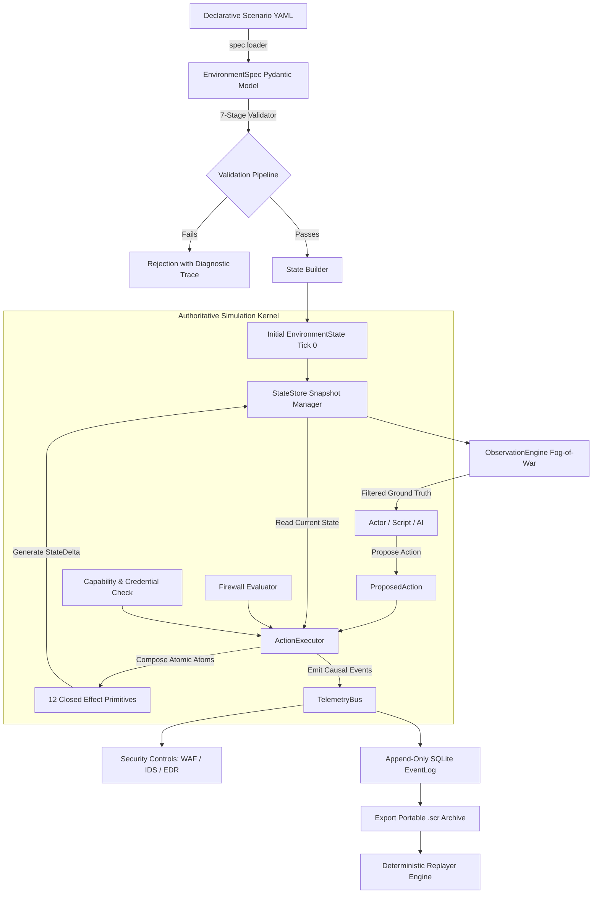
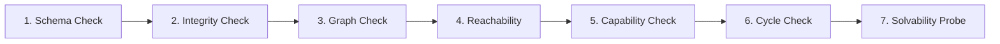
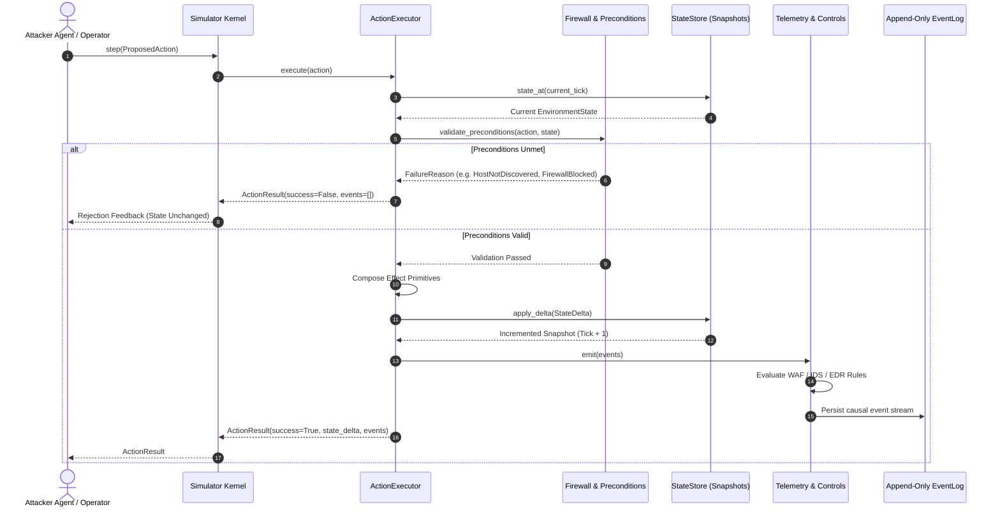
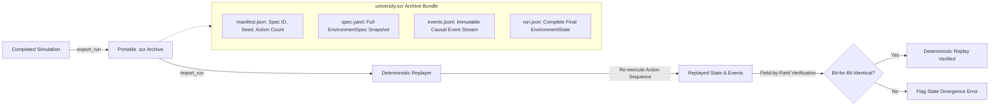
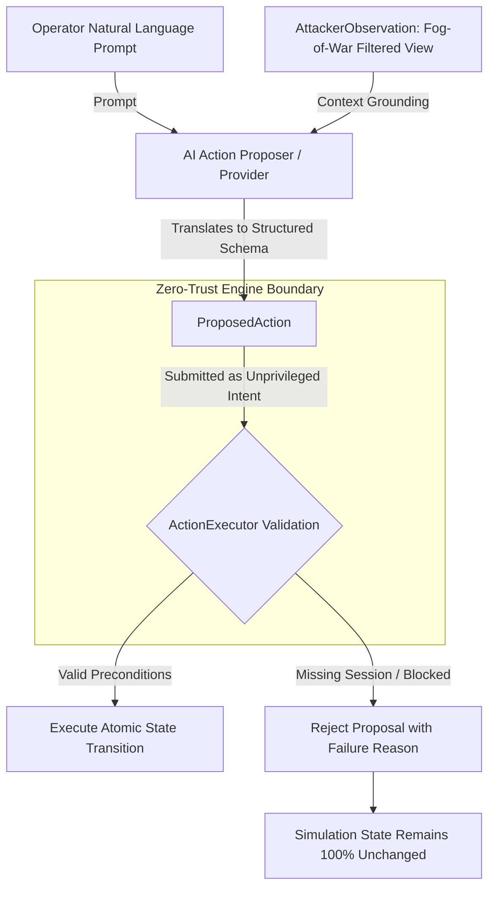
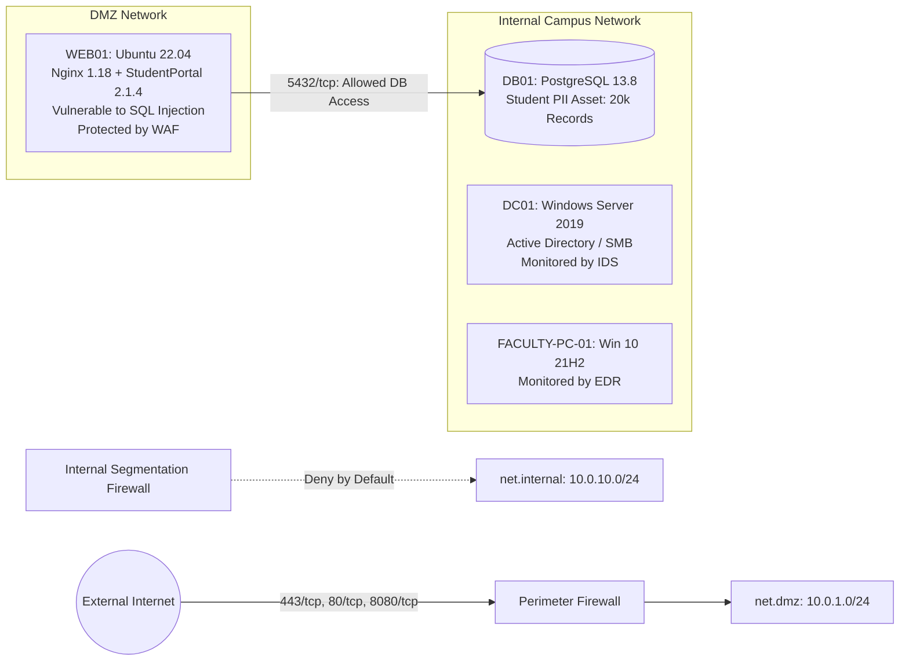
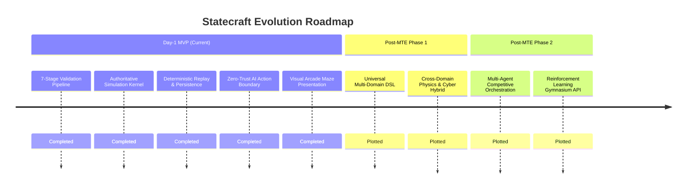

# STATECRAFT — Authoritative Cyber Environment Compiler + Deterministic Action Engine

<p align="center">
  
  
  
  
  
  
</p>

> **"Describe a network in declarative YAML. Compile a verifiable world. Simulate cyber actions with bit-for-bit mathematical determinism, strict fog-of-war constraints, and zero AI hallucination of state."**

---

## 1. Executive Summary

**Statecraft** is an authoritative cyber environment compiler and deterministic simulation engine. Modern cybersecurity training, autonomous agent benchmarking, and red/blue-team experimentation suffer from a fundamental flaw: environments are either fragile, slow, non-deterministic physical virtual machines, or they rely on probabilistic LLM simulations prone to state drift, hallucinations, and unverified transitions.

Statecraft resolves this paradigm by separating **intent proposal** from **state transition authority**:

1. **Compilation & Static Validation:** Declarative scenario manifests (`EnvironmentSpec`) are compiled through a rigorous 7-stage static analysis pipeline before any simulation state can be initialized.
2. **Authoritative Deterministic Execution:** The simulation kernel operates as a closed transition system. For any initial `(EnvironmentSpec, seed, action_sequence)` tuple, the resulting final state, session matrix, and causal event log are **100% bit-for-bit reproducible**.
3. **Strict Fog-of-War & Asymmetric Visibility:** External agents (human operators, automated scripts, or LLM planners) possess zero direct access to the ground truth. Observations are dynamically filtered to what the actor has actively scanned, discovered, or compromised.
4. **Append-Only Causal Event Ledger & Replay:** Every state delta emits immutable events recorded in a causal sequence. Complete runs export to portable `.scr` bundles that re-execute identically across systems.
5. **Zero-Trust AI Action Proposer Boundary:** LLMs act strictly as unprivileged natural-language parsers or action proposers. The engine validates every proposed action against formal preconditions; invalid actions are rejected with zero state mutation.

---

## 2. Core Architectural Guarantees

| Guarantee | Mechanism | Invariant Enforced |
| :--- | :--- | :--- |
| **Engine Authority** | `ActionExecutor` & `StateStore` | Actors (human, script, or AI) can *only* submit `ProposedAction` objects. Direct mutation of `EnvironmentState` is syntactically and architecturally impossible. |
| **Bit-for-Bit Determinism** | `SeededRNG` & Closed Transitions | Identical `(spec, seed, actions)` sequence produces exact identical states, active sessions, and event sequence hashes across arbitrary execution runs. |
| **Fog-of-War Observability** | `ObservationEngine` & `AttackerObservation` | The ground truth topology is masked. Attackers only observe discovered hosts, enumerated services, harvested credentials, and compromised subnets. |
| **Immutability of History** | Snapshot-based `StateStore` | Every state transition creates a new immutable versioned snapshot. Past ticks remain inspectable without side-effects (`state_at(tick)`). |
| **Closed Action & Effect Algebra** | 8 Actions & 12 Effect Primitives | All security operations map strictly to an 8-verb grammar, executed exclusively via 12 closed, atomic effect primitives. |

---

## 3. High-Level Architecture

The Statecraft lifecycle proceeds through a unidirectional, fail-fast compilation and execution pipeline:



---

## 4. The 7-Stage Validation Pipeline

Before any simulation execution can take place, the `EnvironmentSpec` is passed through a pure-code, 7-stage fail-fast static analysis pipeline implemented under `statecraft/validator/`:



1. **Stage 1: Schema Validation (`schema_check.py`)**  
   Enforces structural Pydantic validation, mandatory field constraints, data types, CIDR subnet notations, and enum alignments.
2. **Stage 2: Referential Integrity (`integrity_check.py`)**  
   Guarantees all foreign references resolve: firewall rules reference defined subnets/hosts, service accounts bind to valid hosts, files map to valid owners, and credentials map to declared accounts.
3. **Stage 3: Graph & Topology Validation (`graph_check.py`)**  
   Validates network partitions, detects IP address collisions, verifies subnet CIDR assignments, and checks routing boundary declarations.
4. **Stage 4: Entrypoint Reachability (`reachability.py`)**  
   Verifies that the `initial_attacker_position` has a valid routing path through firewall rules to at least one perimeter DMZ node.
5. **Stage 5: Capability & Vulnerability Validation (`capability_check.py`)**  
   Verifies that all vulnerability effect definitions reference valid effect primitives, valid parameter payloads, and legal actor capabilities.
6. **Stage 6: Cycle & Trust Boundary Detection (`cycle_check.py`)**  
   Detects illegitimate circular trust loops and invalid domain trust chains across enterprise boundaries.
7. **Stage 7: Solvability Probe (`solvability.py`)**  
   Validates graph topological paths from initial footholds to all declared scenario objectives, ensuring scenarios are mathematically solvable.

---

## 5. Formal Domain Grammar: Actions & Effect Primitives

Statecraft eliminates arbitrary execution by implementing a closed, mathematically sound domain grammar.

### The 8 Verbs (Closed Action Grammar)

| Action Verb | Target Type | Preconditions Evaluated | State Progression / Semantics |
| :--- | :--- | :--- | :--- |
| `scan` | Network Subnet | Source network reachability, perimeter firewall permissions. | Discovers active hosts in target subnet. |
| `enumerate` | Discovered Host | Target host must be discovered; firewall must allow probe port. | Discovers running services, versions, and software banners. |
| `authenticate` | Service | Service enumerated; valid credential ID supplied. | Creates active `Session` with declared user/service privilege. |
| `exploit` | Vulnerable Service | Service reachable, running, vulnerability preconditions satisfied. | Triggers declared vulnerability effects (credentials, footholds). |
| `escalate_privilege` | Host | Active session exists; local exploit or admin cred present. | Upgrades session `PrivilegeLevel` (`user` $\to$ `admin` $\to$ `system`). |
| `pivot` | Target Subnet | Active session on multihomed or routing compromise host. | Adds target subnet to attacker's reachable network set. |
| `access_data` | Data Asset / File | Active session with sufficient privilege on hosting node. | Discovers/reads target asset; evaluates scenario objectives. |
| `persist` | Compromised Host | Active session with administrative privilege. | Installs persistent backdoor; maintains access across resets. |

### The 12 Closed Effect Primitives (Atomic State Atoms)

State transitions cannot perform ad-hoc modifications; they are strictly composed of 12 atomic primitives (`statecraft/effects/`):

1. `grant_session`: Instantiates an authenticated session on a target host.
2. `elevate_privilege`: Transitions session privilege to elevated tier (`service`, `admin`, `system`).
3. `revoke_session`: Terminates active host session.
4. `obtain_credential`: Injects credential record into actor's discovered inventory.
5. `discover_asset`: Adds target data asset metadata to actor's known inventory.
6. `discover_service`: Unveils port, protocol, and software version to actor view.
7. `pivot_network`: Expands actor routing table with newly reachable CIDRs.
8. `read_file`: Extracts content payload from local file system asset.
9. `read_data_asset`: Grants access to protected database or application asset.
10. `create_persistence`: Registers persistent entrypoint on compromised system.
11. `disable_control`: Deactivates WAF, IDS, or EDR security control.
12. `achieve_objective`: Marks formal scenario objective as fulfilled at current tick.

---

## 6. Authoritative Simulation Engine & State Transition Flow

State transitions are mediated exclusively through the `ActionExecutor`. The state store guarantees that every tick is an immutable snapshot:



---

## 7. Dual Visibility Planes: Ground Truth vs. Fog of War

Statecraft enforces an asymmetric visibility model separating **Ground Truth** from the **Attacker View**:

```mermaid
flowchart TD
    subgraph Ground Truth [Ground Truth: EnvironmentState]
        ALL_NET[All Subnets: External, DMZ, Internal, Secure Vault]
        ALL_HOST[All Hosts: WEB01, DB01, DC01, Faculty-PC]
        ALL_CRED[All Hashes & Cleartext Credentials]
        ALL_CTRL[Security Controls: WAF, IDS, EDR Rules & Thresholds]
        ALL_OBJ[Target Objectives & Access Control Lists]
    end

    Ground Truth -->|ObservationEngine Masking Filter| FogOfWar

    subgraph FogOfWar [Attacker Observation Plane: AttackerObservation]
        VIS_NET[Reachable Networks: Discovered via scan & pivot]
        VIS_HOST[Discovered Hosts: Only enumerated IP/hostnames]
        VIS_SVC[Discovered Services: Only probed ports & banners]
        VIS_CRED[Known Credentials: Harvested via exploit or file read]
        VIS_SESS[Active Sessions: Established by current actor]
        VIS_OBJ[Discovered Data Assets: Disclosed via reconnaissance]
    end
```

External agents receive `AttackerObservation` objects. If an attacker has not scanned `10.0.10.0/24`, probes targeting hosts in that subnet fail immediately with `FailureReason.HOST_NOT_DISCOVERED` without revealing host existence.

---

## 8. Real-Time Telemetry & Security Detection System

The engine's `TelemetryBus` broadcasts synchronous domain events during action execution. Active defensive controls monitor the bus and trigger detections based on configurable rules:

* **Web Application Firewall (WAF):** Detects pattern-based exploitation (e.g., SQL Injection targeting web portals) with configurable detection probabilities and zero-tick alert latencies.
* **Intrusion Detection System (IDS):** Detects unauthorized network scanning, repeated authentication failures, and lateral traversal across internal boundaries.
* **Endpoint Detection & Response (EDR):** Hooks privilege escalation and persistence mechanism creation on monitored hosts.

Every detection generates an immutable `detection_triggered` event containing control identifiers, alert rules, and target metadata.

---

## 9. Deterministic Persistence & Replay Architecture

Statecraft includes full run archival and re-execution capabilities:



To replay any exported simulation run:

```bash
statecraft replay runs/university.scr
```

The replayer reconstructs the exact environment, executes the identical action sequence, and asserts that:
* Final tick counts match exactly.
* Active session matrices match across all hosts and privileges.
* Achieved objectives match identically.
* Generated event hashes match the recorded log bit-for-bit.

---

## 10. AI Action Proposer Boundary (Zero-Trust Architectural Gate)

Statecraft integrates with Large Language Models via an unprivileged **Action Proposer** boundary (`statecraft/ai/`):



### The Architectural Iron Rule
> **The AI layer has ZERO authority to directly mutate state, inject sessions, create credentials, or mark objectives.**  
> It cannot hallucinate an exploit or skip firewall rules. Every proposal must survive the engine's deterministic precondition validators.

---

## 11. Visual Demonstration Layer (Arcade Maze Cyber Metaphor)

Statecraft includes an interactive browser visualizer accessible via:

```bash
statecraft demo --visual
```

The visualizer renders the actual compiled network topology as an **orthogonal cyber maze**, translating abstract infrastructure into an intuitive visual language:

```
  ┌────────────────────────────────────────────────────────────────────────┐
  │ [WEB01: DMZ Gateway] ════════ WAF GATE ════════ [DB01: Secure Vault]   │
  │          ║                                             ║               │
  │      Corridor                                      Corridor            │
  │          ║                                             ║               │
  │    [ATTACK PROBE] ──(Discovers)──> [CREDENTIALS] ──(Access)──> [PII]   │
  └────────────────────────────────────────────────────────────────────────┘
```

* **Attacker Probe:** Yellow autonomous probe navigating corridors based on causal simulation events.
* **Corridors & Intersections:** Orthogonal channels representing network routing paths and firewall channels.
* **Security Gates:** Active WAF / IDS / EDR barriers pulsing with defensive status indicators.
* **Data Vaults:** Protected storage repositories holding scenario target objectives (e.g., student PII).
* **Deterministic Event Streaming:** 100% backed by real simulation events emitted from the local engine HTTP server—never a canned or simulated mock animation.

---

## 12. University Network Reference Scenario (`scenarios/university-network.yaml`)

The primary reference scenario models an enterprise-tier higher education infrastructure:



### The 7-Tick Realistic Kill Chain

1. **Tick 1 — Reconnaissance:** Attacker scans `net.dmz`, discovering `WEB01` (`10.0.1.10`).
2. **Tick 2 — Service Enumeration:** Probes `WEB01`, uncovering `StudentPortal 2.1.4` on port `8080`.
3. **Tick 3 — Web Exploitation:** Exploits SQL Injection vulnerability (`vuln.sqli-studentportal`). WAF triggers detection; attacker harvests database application credentials (`cred.db01.app_user`).
4. **Tick 4 — Network Pivoting:** Leverages compromised web server to pivot network routing into `net.internal` (`10.0.10.0/24`).
5. **Tick 5 — Internal Service Enumeration:** Probes internal database host `DB01`, discovering `PostgreSQL 13.8` on port `5432`.
6. **Tick 6 — Lateral Authentication:** Authenticates against `DB01` using harvested service credentials, establishing an active service session.
7. **Tick 7 — Objective Completion:** Issues `access_data` against `asset.student_pii`, successfully completing the primary scenario objective (`obj.exfiltrate_pii`).

---

## 13. Quickstart & Installation Guide

### Prerequisites
* Python 3.11+
* Standard package manager (`pip` or `uv`)

### 1. Installation

```bash
# Clone the repository
git clone https://github.com/BrocodeADI/statecraft.git
cd statecraft

# Install in editable mode with development dependencies
pip install -e ".[dev]"
# Or using uv:
uv pip install -e ".[dev]"
```

### 2. Verify Scenario Syntax & Validity

```bash
statecraft validate scenarios/university-network.yaml
```

### 3. Inspect Compiled Scenario Topology

```bash
statecraft show scenarios/university-network.yaml
```

### 4. Execute a Deterministic Simulation Run

```bash
statecraft run --scenario scenarios/university-network.yaml --out runs/university.scr
```

### 5. Deterministically Replay Recorded Run

```bash
statecraft replay runs/university.scr
```

---

## 14. CLI Reference Manual

Statecraft provides a comprehensive Typer-powered CLI interface:

| Command | Key Arguments & Flags | Description |
| :--- | :--- | :--- |
| `statecraft validate` | `<scenario.yaml>` | Executes the 7-stage static validation pipeline; returns exit code 0 or structured errors. |
| `statecraft show` | `<scenario.yaml>` | Renders a terminal overview of networks, hosts, services, controls, and objectives. |
| `statecraft run` | `-s, --scenario`, `-o, --out`, `-a, --agent` | Executes a simulation run, records telemetry, and exports an archive bundle (`.scr`). |
| `statecraft replay` | `<run.scr>` | Re-executes a recorded `.scr` archive, asserting bit-for-bit final state and event equivalence. |
| `statecraft demo` | `--fast`, `--ai`, `--visual`, `-s, --scenario` | Executes complete end-to-end presentation slice with live validation, simulation, and replay. |
| `statecraft ai` | `-p, --prompt`, `-s, --scenario` | Interactive REPL or one-shot mode demonstrating AI intent translation to engine actions. |

---

## 15. Repository Structure

```
Statecraft/
├── scenarios/
│   └── university-network.yaml       # Primary reference enterprise environment spec
├── statecraft/
│   ├── actions/                       # 8 closed action definitions and schemas
│   ├── agents/                        # Scripted reference attacker agents
│   ├── ai/                            # Zero-trust AI Action Proposer & pipeline
│   ├── cli/                           # Typer CLI commands and Rich formatters
│   ├── effects/                       # 12 closed atomic state transition primitives
│   ├── engine/                        # Authoritative kernel (Executor, StateStore, RNG)
│   ├── model/                         # Core domain models (State, Events, Actions)
│   ├── observation/                   # Fog-of-war masking and visibility engine
│   ├── persistence/                   # Append-only SQLite event log & .scr exporter
│   ├── replay/                        # Deterministic replayer and verifier
│   ├── spec/                          # EnvironmentSpec Pydantic definitions and loader
│   ├── telemetry/                     # TelemetryBus and security control evaluators
│   ├── validator/                     # 7-stage fail-fast static analysis pipeline
│   └── visual/                        # Arcade maze visualizer adapter & local HTTP server
│       ├── adapter.py                 # Ground-truth to visual JSON converter
│       ├── server.py                  # Local embedded HTTP dashboard server
│       └── static/
│           └── index.html             # SVG orthogonal cyber maze dashboard
├── tests/
│   ├── fixtures/                      # Common spec fixtures and test seeds
│   ├── integration/                   # Full end-to-end kill chain integration tests
│   ├── property/                      # Hypothesis property-based determinism tests
│   └── unit/                          # Unit tests covering all subsystems (86 tests)
├── ARCHITECTURE.md                    # Detailed architectural summary specification
├── PBL_DEMO.md                        # Academic project presentation & evaluation guide
├── PBL_VERIFICATION.md                # Engineering verification report
├── pyproject.toml                     # Project packaging and dependency manifest
└── uv.lock                            # Deterministic pinned dependency lockfile
```

---

## 16. Verification & Test Suite

Statecraft adheres to rigorous quality assurance combining unit tests, end-to-end integration tests, and Hypothesis property tests:

```bash
uv run pytest -v
```

```
============================= test session starts =============================
platform win32 -- Python 3.13.14, pytest-8.3.4, pluggy-1.6.0
rootdir: C:\Users\chakr\Downloads\PBL-3(probable project)\Statecraft
configfile: pyproject.toml
testpaths: tests
collected 86 items

tests/integration/test_full_scenario.py::test_university_scenario_full_attack_path PASSED
tests/property/test_invariants.py::test_deterministic_simulation_invariant PASSED
tests/property/test_invariants.py::test_action_never_mutates_previous_snapshots_invariant PASSED
tests/property/test_invariants.py::test_effects_stay_within_closed_vocabulary PASSED
tests/unit/test_demo_and_ai.py (8 tests) .................................... PASSED
tests/unit/test_effects.py (9 tests) ....................................... PASSED
tests/unit/test_executor.py (5 tests) ...................................... PASSED
tests/unit/test_model.py (7 tests) ......................................... PASSED
tests/unit/test_observation.py (1 test) .................................... PASSED
tests/unit/test_replay.py (3 tests) ........................................ PASSED
tests/unit/test_validator.py (7 tests) ..................................... PASSED
tests/unit/test_visual.py (42 tests) ....................................... PASSED

============================= 86 passed in 1.49s ==============================
```

### Critical Property Invariants Verified
1. **Mathematical Determinism:** $R(S_0, \vec{A}, \text{seed}) \equiv R'(S_0, \vec{A}, \text{seed})$ across arbitrary execution runs.
2. **Snapshot Immutability:** Executing actions at tick $T$ does not alter snapshots at ticks $0 \dots T-1$.
3. **Closed Effect Grammar:** State mutations never violate the 12 closed effect primitives.
4. **Boundary Isolation:** AI action proposals without prerequisite credentials or routes never produce state changes.

---

## 17. Security & Threat Modeling Context

Statecraft is intentionally designed for defensive security research, red/blue-team simulation, and cyber autonomy benchmarking:

* **Safe Synthetic Execution:** No real packets are transmitted; no actual exploits are executed. Vulnerabilities and effects are simulated as formal state transitions.
* **Zero Host Vulnerability:** The engine runs in user-space without root/administrator privileges. Scenarios cannot compromise host systems.
* **Deterministic Defenses:** Defensive controls (WAF, IDS, EDR) evaluate causal events against formal rule triggers, providing reproducible detection data for machine learning and detection engineering.

---

## 18. Academic & Educational Context (PBL / MTE)

Statecraft was developed as an advanced Project-Based Learning (PBL) research prototype for the Mid-Term Evaluation (MTE). It addresses key computer science and cyber operations challenges:

* **Discrete Event Simulation:** Modeling complex distributed systems as formal finite-state machines.
* **Compiler Design & Static Analysis:** Applying compiler verification techniques (referential integrity, graph reachability, cycle detection) to network architecture.
* **Safe Autonomous Agent Benchmarking:** Providing a reproducible sandbox for evaluating LLM cybersecurity reasoning without risk of unauthorized real-world execution.

---

## 19. Current MVP Status vs. Post-MTE Research Roadmap

> [!IMPORTANT]
> **Current Status: Day-1 MVP Complete & Verified.**  
> Statecraft is currently a specialized, verified, deterministic **cybersecurity simulation engine**. The post-MTE research roadmap outlines the theoretical generalization into universal multi-domain simulation.



| Subsystem | Day-1 MVP Status (Current) | Post-MTE Direction (Future) |
| :--- | :--- | :--- |
| **Domain Scope** | Enterprise Cybersecurity (Networks, Hosts, WAF, Exploits) | Universal Multi-Domain Simulation (Cyber, Cyber-Physical, Logistics) |
| **Agent Support** | Single-attacker scripted kill-chain + AI Proposer boundary | Multi-agent autonomous competitive simulation (Red vs. Blue vs. Users) |
| **Environment Compiler** | 7-stage static validator for `EnvironmentSpec` YAML | Generalized schema compiler with domain-specific rule plugins |
| **Replay Engine** | Deterministic `.scr` bundle verification | Distributed event tracing and time-travel branch debugging |

---

## 20. Contributing Guidelines

1. **Maintain Invariants:** All contributions must strictly preserve the authoritative engine model, snapshot immutability, and deterministic replay guarantees.
2. **Grammar Adherence:** New capabilities must be modeled using the existing closed action and effect vocabulary unless a formal RFC expanding the algebra is approved.
3. **Test Coverage:** All new features require matching unit tests, integration tests, and Hypothesis property invariants.
4. **Code Quality:** Format with standard Python formatters and ensure 100% pass rates across the test suite (`uv run pytest -v`).

---

## 21. License

This project is licensed under the **MIT License**. See the `LICENSE` file for details.

---

## 22. Acknowledgments & Citations

Statecraft builds upon foundational research in discrete-event simulation, automated cyber reasoning, and deterministic state-machine replication.

If you utilize Statecraft in academic work or benchmarking, please cite:

```bibtex
@software{statecraft2026,
  author = {Statecraft Research Group},
  title = {Statecraft: Cyber Environment Compiler + Deterministic Action Engine},
  url = {https://github.com/BrocodeADI/statecraft},
  version = {0.1.0},
  year = {2026}
}
```
